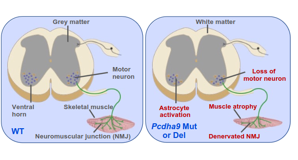

# PCDHA9-ALS-Candidate-Gene-Functional-Identification

Here is the code of our paper: **Functional identification of protocadherin alpha 9 (PCDHA9) as a candidate causative gene for amyotrophic lateral sclerosis**

**If you have any questions, please contact us：**[**Our Lab**](http://english.genetics.cas.cn/people/faculty/index_20424.html?json=http://sourcedb.genetics.cas.cn/yw/people/peop/faculty/200907/t20090721_2130952.json)

## Table of Contents
- [Introduction](#introduction)
- [Dataset](#dataset)
- [Results](#results)
- [Acknowledgments](#acknowledgments)

## Introduction

Amyotrophic lateral sclerosis (ALS) is a devastating neurodegenerative disease. To identify additional genetic contributors to ALS, we analyzed exome sequences in a large cohort of Chinese ALS patients. We found a homozygous variant (p.L700P) in PCDHA9 in three unrelated patients but not in publicly available genomic databases. We generated Pcdhα9 mutant mice harboring either orthologous point mutation or deletion mutation. These mice developed progressive spinal motor loss, muscle atrophy, and structural/functional abnormalities of the neuromuscular junction, leading to paralysis and early lethality. Mechanistically, we demonstrate that Pcdha9 mutation causes aberrant activation of FAK and PYK2 in the aged spinal cord. Furthermore, we uncovered a novel PCDHA9-interacting protein, Na+/K+ ATPase-α1, and its dramatically reduced expression in mutant motor neurons. Accordingly, single nucleus multi-omics analysis revealed disturbed networks or signaling involved in cell/cell-cell adhesion, ion transport, synapse organization, and neuronal survival in aged mutant mice. Together, our results present PCDHA9 as a new candidate ALS gene and provide insights into its pathogenesis.

## Dataset
The raw sequence data from both snRNA-seq and snATAC-seq, as well as the human samples documented within this study, have been deposited in Genome Sequence Archive (Chen et al., 2021) in National Genomics Data Center (CNCB-NGDC Members and Partners, 2022), China National Center for Bioinformation / Beijing Institute of Genomics, Chinese Academy of Sciences (GSA: CRA007917; HRA003114) that are publicly accessible at https://ngdc.cncb.ac.cn/gsa. Additionally, the processed data derived from snRNA-seq and snATAC-seq are conveniently accessible through the Gene Expression Omnibus (http://www.ncbi.nlm.nih.gov/geo) under the SuperSeries accession GEO: GSE234783. Furthermore, the mass spectrometry proteomics data have been deposited to the ProteomeXchange Consortium (http://proteomecentral.proteomexchange.org) through the iProX partner repository with the dataset identifier PXD042929. 

## Results
Recent progress in ALS genetics and the discovery of new ALS genes presents an opportunity to generate novel models to explore the pathogenesis of the disease and identify therapeutic targets shared between distinct forms of ALS. Here, we identified PCDHA9 as a candidate ALS gene because its targeted mutation and deletion in mice recapitulate most of the neuropathological and clinical phenotypes of ALS.
our orthologous point mutation mouse model based on the recurrent mutation found in ALS patients accurately recapitulated most neuropathological and clinical phenotypes of ALS. The late disease onset and progressive phenotypes make the PCDHA9 mutant new ALS-relevant physiological systems to explore disease mechanisms including the early onset of ALS, and to test potential therapeutics. Combined with multi-omics analysis, we identified the disturbed gene regulatory networks and signaling involved in cell/cell-cell adhesion, ion transport, synapse organization and neuronal survival in aged mutant mice. 

## Acknowledgments
We are grateful to everyone who has contributed to this project in various ways. Thank you!

